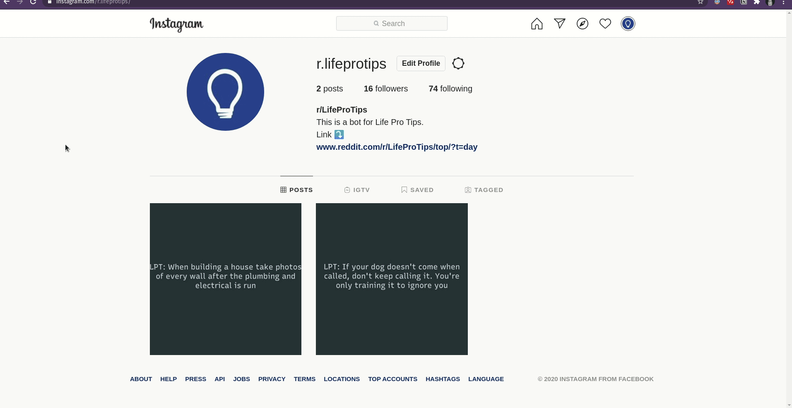
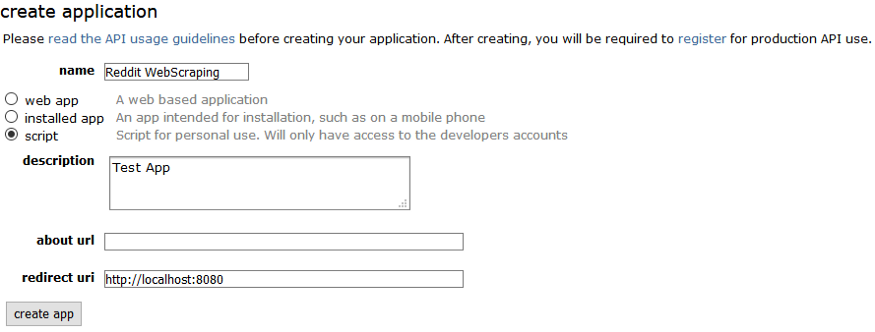
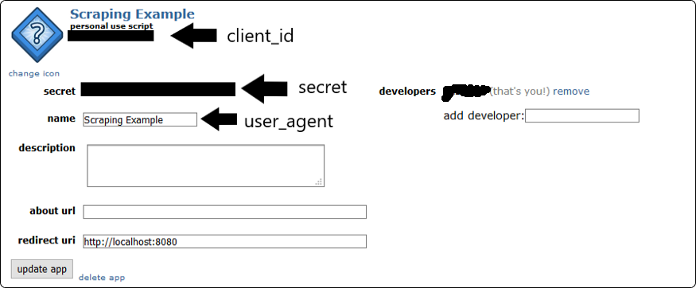

# R2IBot
[This](https://www.instagram.com/r.lifeprotips/) is the bot in all it's glory.


# About

This is a bot which scrapes data from Reddit using PRAW from a subreddit (in the form a string as of now) and posts it on Instagram using Instagram custom API.
It uses PIL to convert and draw the string onto an image.

:exclamation: **Note:** This uses InstaBot to make the API call to Instagram which is no longer supported due to misuse of such bots. So make sure you use it only to upload posts and not use this code as an autolike,autofollow etc bot. Instagram is mass banning such open source projects and they have chenged thier API policy as well in June,2020.

# Requirements

You need to have Reddit account for the Reddit API which will act as a Python Wrapper for PRAW so create that and head towards [this](https://www.reddit.com/prefs/apps) link and click on create app or create another app.

This will open a form where you need to fill in a name, description and redirect uri. For the redirect uri you should choose [http://localhost:8080](http://localhost:8080/) as described in the PRAW [documentation](https://praw.readthedocs.io/en/latest/getting_started/authentication.html#script-application).



After pressing create app a new application will appear. Here you can find the authentication information needed to create the praw.Reddit instance.



You can then add these values along with the credentials of your Instagram and Reddit account to the [secret.py](http://secret.py) document and that's it.

# Install dependencies

In the working directory run:

```python
sudo pip3 install -r requirements.txt
```

# Run

In the working directory run:

```python
python3 main.py
```

# To-Do


- [ ]  Captions support(top 10 trending hashtags along with credit to the redditor).
- [ ]  Make it run 24/7 on AWS E2C server.
- [ ]  Find a way to store credentials more securely.